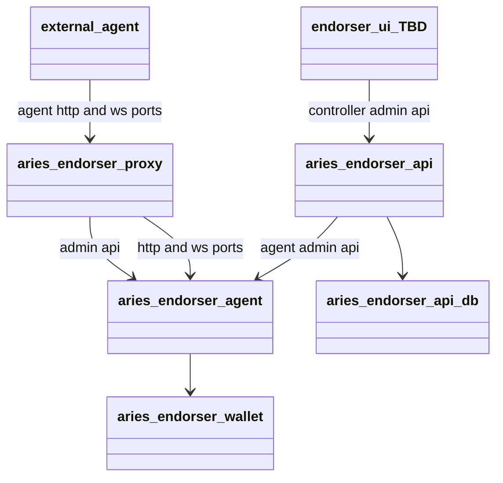

# The Aries Endorser Configurations

This repository contains the [openshift-developer-tools](https://github.com/BCDevOps/openshift-developer-tools/tree/master/bin) compatible OpenShift configurations for the Aries Endorser Service. For more information, see the Aries Endorser Service repository [here](https://github.com/bcgov/aries-endorser-service)

For information on how to use these configurations with the `openshift-developer-tools scripts` please refer to the documentation; [README.md](https://github.com/BCDevOps/openshift-developer-tools/blob/master/bin/README.md).

## Endorser Services

## Getting Help or Reporting an Issue

To report bugs/issues/feature requests, please file an [issue](../../issues).

## How to Contribute

If you would like to contribute, please see our [CONTRIBUTING](./CONTRIBUTING.md) guidelines.

Please note that this project is released with a [Contributor Code of Conduct](./CODE_OF_CONDUCT.md). 
By participating in this project you agree to abide by its terms.